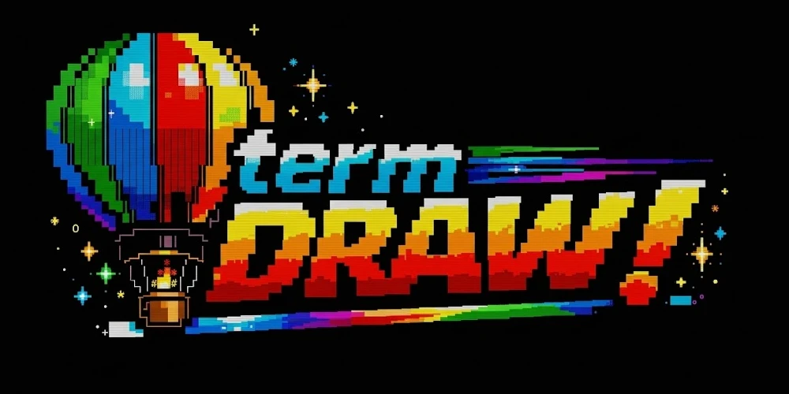

<p align="center">
  
</p>

<h1 align="center">termDRAW!</h1>

<p align="center">
  <a href="https://github.com/benvinegar/termdraw/actions/workflows/ci.yml?query=branch%3Amain">
    
  </a>
  <a href="https://github.com/benvinegar/termdraw/releases">
    
  </a>
  <a href="LICENSE">
    
  </a>
  <a href="https://bun.sh">
    
  </a>
</p>

<p align="center">
  A terminal drawing editor for developers who want editable diagrams, UI mocks, and text graphics without leaving the terminal.
</p>

## Packages

- `@termdraw/app` — the standalone terminal app with the `termdraw` command
- `@termdraw/opentui` — embeddable OpenTUI components and renderables
- `@termdraw/pi` — Pi package that opens termDRAW in a Pi overlay

## Install the app

Requirements:

- [Bun](https://bun.sh) 1.3+
- A terminal with mouse support

```bash
npm install --global @termdraw/app
```

## Quick start

```bash
termdraw
```

Draw something, then press `Enter` or `Ctrl+S` to export the rendered art to stdout.

Press `Ctrl+D` to save the editable diagram as a native `.td.json` document. If you opened a diagram with `--diagram`, termDRAW reuses that path by default; otherwise it prompts for one inside the app.

## App usage

```bash
# open an editable native document from a file
termdraw --diagram architecture.td.json

# open an editable native document from stdin
cat architecture.td.json | termdraw --diagram -

# save the rendered art directly to a file
termdraw --diagram architecture.td.json --output diagram.txt

# save plain text directly to a file
termdraw --output diagram.txt

# export a fenced Markdown code block
termdraw --fenced > diagram.md

# show CLI help
termdraw --help
```

termDRAW! outputs terminal text, not SVG or bitmap graphics.

Use native `.td.json` documents when you want to reopen and keep editing a drawing. Plain-text output remains an export format and does not preserve the original object metadata.

## Use it in Pi

```bash
pi install npm:@termdraw/pi
```

Then inside Pi:

```text
/termdraw
```

## Embed in an OpenTUI app

```bash
npm install @termdraw/opentui @opentui/core @opentui/react react
```

```tsx
import { createCliRenderer } from "@opentui/core";
import { createRoot } from "@opentui/react";
import { TermDrawApp } from "@termdraw/opentui";

const renderer = await createCliRenderer({
  useMouse: true,
  enableMouseMovement: true,
  autoFocus: true,
  screenMode: "alternate-screen",
});

createRoot(renderer).render(
  <TermDrawApp
    width="100%"
    height="100%"
    autoFocus
    initialDocument={existingDocument}
    diagramPath="architecture.td.json"
    onSave={(art) => {
      console.log(art);
    }}
    onSaveDiagram={async (document, path) => {
      await Bun.write(path, `${JSON.stringify(document, null, 2)}\n`);
    }}
    onCancel={() => {
      renderer.destroy();
    }}
  />,
);
```

Also exported from `@termdraw/opentui`:

- `TermDrawApp`
- `TermDrawEditor`
- `TermDraw`
- `TermDrawAppRenderable`
- `TermDrawEditorRenderable`
- `TermDrawRenderable`
- `formatSavedOutput`
- `buildHelpText`
- `parseDrawDocument`

## Docs

- App package: [`packages/app`](https://github.com/benvinegar/termdraw/tree/main/packages/app)
- OpenTUI package: [`packages/opentui`](https://github.com/benvinegar/termdraw/tree/main/packages/opentui)
- Pi package: [`packages/pi`](https://github.com/benvinegar/termdraw/tree/main/packages/pi)

## Contributing

Contributions are welcome.

Before opening a PR:

- keep the change focused
- run `bun run check`
- add or update tests when editor behavior changes
- open an issue first for larger UX or API changes

## Security

Please report security issues privately through GitHub Security Advisories:

- <https://github.com/benvinegar/termdraw/security/advisories/new>

## License

MIT. See [LICENSE](LICENSE).
